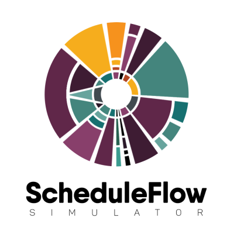

My research focuses on accelerating domain science applications in the Exascale era by developing advanced, performance-portable solutions for High-Performance Computing (HPC), Artificial Intelligence (AI), and large-scale data management.

<h2 id="data">Data Management</h2>

<h3 id="rapids"> RAPIDS: Optimizing Application Workflows and I/O </h3>

The RAPIDS SciDAC Institute aims to enhance the usability and performance of data and visualization solutions for scientific applications running on leadership-class supercomputers. As the co-lead of the Data Understanding thrust within RAPIDS, I engage with various SciDAC partnerships identifying technical data challenges and co-developing potential solutions tailored to the unique needs of cutting-edge scientific simulations. This involves optimizing the entire data lifecycle, from simulation output to analysis and visualization, ensuring applications can efficiently leverage exascale resources.

Focus: Collaborative optimization of application workflows, I/O strategies, and visualization solutions for SciDAC Partnerships.

<h3 id="rapids"> ADIOS: GPU-backend, Derived Variables Computation, and Remote Access</h3>

The Adaptable I/O System (ADIOS) is a high-performance, open-source I/O framework used by large-scale scientific applications to achieve efficient data management and movement at exascale. My work as an ADIOS developer has centered on extending the library's capabilities to handle modern, heterogeneous computing environments and support intelligent data processing.

* GPU-Enabled I/O: Core features have been added to enable ADIOS to interface with applications running on GPUs allowing for efficient metadata computation directly on the device.
* In-situ Data Processing and Querying: The query engine allows the library to compute complex quantities of interest (derived variables) in real-time. This processing supports intelligent data querying and remote access, ensuring that only the relevant portions of the massive datasets are transferred, thereby reducing I/O bandwidth usage and post-processing latency.

Focus: GPU I/O Optimization, In-situ Derived Variable Computation, and Query Engine Development

<h3 id="scheduleflow"> Simulator </h3>

For our experiments we built a simulator for HPC scheduelers, called [ScheduleFlow](https://github.com/anagainaru/ScheduleFlow).

The ScheduleFlow software consists of a series of scripts and classes that offer an API allowing users to create simulation scenarios for any type of online and reservation-based batch schedulers. 

<h3 id="speculative_software"> Software </h3>

The simulator has been extended to allow speculative scheduling by 
overwriting the amount of requested resources by an application to 
values based on the past behavior patterns. The code is open source
and available on [GitHub](https://github.com/vanderbiltscl/SpeculativeScheduling)

You are encouraged to contribute to ScheduleFlow or SpeculativeScheduling.
Questions and bugs can be reported through GitHub by creating a new issue 
in the corresponding repository with the "bug" or "question" tags.

<h2 id="io">I/O congestion</h2>

Many scientific HPC applications generate or deal with 
TeraBytes of data during their lifetime (for example, 
the Large Hadron Collider generates
15PB/year, light source projects deal with 300TB of data
per day and climate modeling are expected to have to
deal with more than 100EB of data). 
Moreover, I/O throughput and memory access time has an order of 
magnitude slower increase rate than FLOPs for the new 
generation of supercomputers. 

To help with the ever growing amount of data created,
architectural improvement such as burst buffers
have been added to the system. In addition, work is being done
to transform the data before sending it to the disks
in the hope of reducing the I/O sent. However, observations show 
that I/O transfer can still be slowed down up to 70% due to congestion
on current HPC systems.

This project investigates different optimization solutions 
to be included in the I/O middleware in order to alleviate 
the impact of congestion on applications.

<h2 id="resiliency">Fault tolerance</h2>

HPC sysytems today contain more than 100,000 processing and memory units.
With an individual MTBF (Mean Time Between Failures) for one unit of, one century,
an HPC system will encounter a failure every 9 hours in average, 
which is smaller than the execution time of many HPC applications.
In addition to fail-stop failures, silent errors are not detected immediately,
but instead after some arbitrary detection latency can cause applications 
to degrade their performance, crash or reach a false result. 

This project investigates performance variability issues and
resiliency properties of scientific applications and HPC systems.
We are working on understanding the intrinsic applcication resiliency to
silent errors and how to leverage it to optimze the amount of resources
required by a successful run (for example, by decreasing the precision of 
computations and reducing the energy and memory footpring of an application)
The project also includes designing new fault tolerance methods by 
including preventive methods based on hardware counters and
application memory, network and computational patterns to optimizing 
current checkpointing strategies.

<h3 id="software">System level tools</h3>

**HELO (Hierarchical Event Log Organizer)**

A tool for extracting event templates from large datasets and updating them as new events get
generated. HELO presents an intuitive output to system administrators. It is currently integrated
in the Blue Water software stack.

