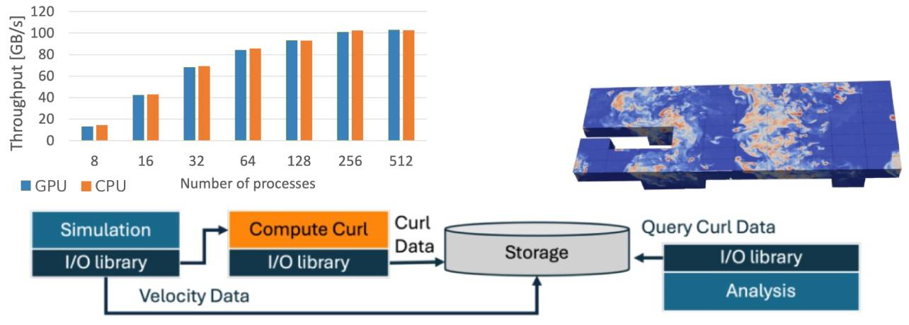
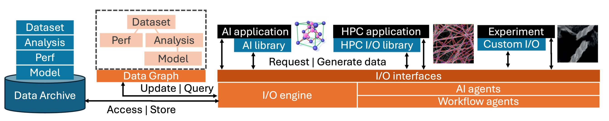
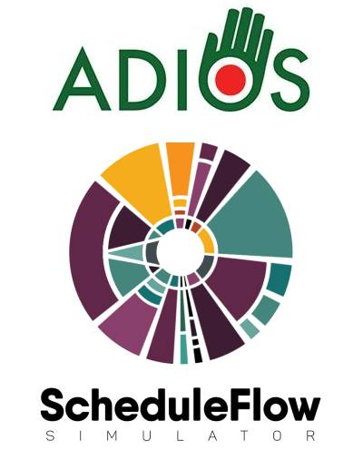

My research focuses on accelerating domain science applications in the Exascale era by developing advanced, performance-portable solutions for High-Performance Computing (HPC), Artificial Intelligence (AI), and large-scale data management.

<h2 id="data">Data Management</h2>

<h3 id="rapids"> RAPIDS: Optimizing Application Workflows and I/O </h3>
Collaborative optimization of application workflows, I/O strategies, and visualization solutions for SciDAC Partnerships.

The RAPIDS SciDAC Institute aims to enhance the usability and performance of data and visualization solutions for scientific applications running on leadership-class supercomputers. As the **co-lead of the Data Understanding thrust** within RAPIDS, I engage with various SciDAC partnerships identifying technical data challenges and co-developing potential solutions tailored to the unique needs of cutting-edge scientific simulations. This involves optimizing the entire data lifecycle, from simulation output to analysis and visualization, ensuring applications can efficiently leverage exascale resources.

<h3 id="rapids"> ADIOS: GPU-backend, Derived Variables Computation, and Remote Access</h3>
GPU I/O Optimization, In-situ Derived Variable Computation, and Query Engine Development

The Adaptable I/O System (ADIOS) is a high-performance, open-source I/O framework used by large-scale scientific applications to achieve efficient data management and movement at exascale. My work as an ADIOS developer has centered on extending the library's capabilities to handle modern, heterogeneous computing environments and support intelligent data processing.

* **GPU-Enabled I/O**: Core features have been added to enable ADIOS to interface with applications running on GPUs allowing for efficient metadata computation directly on the device.
* **In-situ Data Processing and Querying**: The query engine allows the library to compute complex quantities of interest (derived variables) in real-time. This processing supports intelligent data querying and remote access, ensuring that only the relevant portions of the massive datasets are transferred, thereby reducing I/O bandwidth usage and post-processing latency.

<h2 id="hpc-ai">HPC/AI Workflow Management</h2>

<h3> ModCon: Self-improving AI Models </h3>
Establish a "data flywheel" — a continuous improvement loop for scientific AI models to maintain predictive accuracy and utility.

The American Science Cloud (AmSC) for building infrastructure and the the Transformational AI Models Consortium (ModCon) for organizing data and model building are DOE initiatives focused on accelerating scientific discovery by enhancing how domain scientists utilize Artificial Intelligence (AI) and building partnerships that align DOE’s scientific enterprise with leading commercial 
advances. As the leader of the Self-Improving AI Models thrust within ModCon, my work addresses the challenge of keeping domain-specific AI models current and scientifically relevant.

* Addressing Model Staleness: Domain-specific AI models (in materials science, biology, physics, etc.) can rapidly become stale as new experimental data, advanced simulations, and emerging methods are introduced. My group focuses on solving this fundamental limitation.
* The Agentic Harness: The core of this thrust is the development of an agentic harness — an AI-driven orchestration layer that automates the complete model life cycle. This intelligent layer enables models to self-improve continuously by: (i) Monitoring incoming data streams and current model performance; (ii) Deciding when and how to update the model; (iii) Orchestrating the entire process of retraining, validation, and deployment.

<h3>Managing the complete lifecycle of data within workflows</h3>
Provenance tracking, logical organization of scientific datasets, and efficient data query across workflows. 

As scientific applications scale, managing the associated vast, interconnected datasets in near-real-time and for post-mortem analysis becomes critical. Campaign management provides the necessary framework to logically organize these datasets into campaigns, tracking the complex provenance and relationships between all generated data. This includes linking simulation inputs, raw outputs, performance metrics, analysis results, and derivative products (like images or refined data).

My work focuses on developing efficient querying mechanisms over these campaigns to seamlessly bring relevant data into any part of a scientific workflow.
* **Reproducibility**: Quickly identifying and fetching all the necessary input and output data to precisely reproduce a previous simulation or experiment.
* **AI/ML Training Workflows**: Enabling intelligent, self-improving AI models to use campaign history. For instance, the training code can query the campaign database to determine if a required simulation has already been executed. If so, it can fetch the pre-existing data in the correct format, avoiding redundant computation and significantly accelerating model accuracy improvements through data steering and reuse.

<h3> Scheduling (Tasks Associated with Experiments or Large Simulations, Speculative Scheduling) </h3>
Designing and implementing novel computational models for large-scale resource management to accommodate stochastic and priority-focused tasks. 

The standard approach to HPC scheduling relies on reservation-based batch scheduling using priority queues and backfilling. While effective for traditional scientific applications, this model often leads to suboptimal performance for emerging classes of applications, particularly stochastic AI workflows and those in domains like neuroscience and bioinformatics, which prioritize productivity and exhibit unpredictable resource requirements.

* Accommodating Unpredictable Resource Needs: The developed scheduling strategies move beyond static resource reservations to efficiently handle workflows with highly variable demands over time in terms of accuracy, time and resource utilization.
* Prioritized and Accuracy-Driven Tasks: I address the need for tasks associated with domain science workflows to be executed with different priorities and accuracies at every step. For example, a task might involve ingesting accurate or refactored data based on its specific deadline or the current requirements of the main simulation, necessitating a flexible and speculative scheduling approach.
* Productivity over Performance: The goal is to design systems that maximize scientific productivity for these application domains, ensuring their complex, multi-stage tasks can reliably access and utilize resources at large scale.

<h2 id="software"> Software </h2>

My research contributions are underpinned by active development in several open-source software projects and custom frameworks designed to manage, optimize, and automate large-scale scientific workflows on leadership-class computing facilities.

* I am a core developer of the **ADIOS high-performance I/O framework**. My contributions focus on adapting the library for modern, heterogeneous computing architectures and for supporting in-situ derived variables computation and data querying.
   * Link: https://github.com/ornladios/ADIOS2
* The **data lifecycle framework** provides the necessary software infrastructure to organize and track complex provenance of data generated by scientific workflows.
* The **AI Framework for Self-Improvement** (ModCon Agentic Harness) is the implementation of the Self-Improving AI Models thrust within the ModCon project. It is designed to automate the full life cycle of domain-specific AI models.
* **ScheduleFlow** is a lightweight, user-friendly tool developed to simplify the process of creating and simulating large-scale scientific scheduling scenarios. It consists of a series of Python scripts and classes that offer a simple API and it allows researchers to quickly create various simulation scenarios, without the overhead of learning and configuring complex, full-featured simulators like SimGrid or BatSim (e.g., bypassing unnecessary details like memory and network configurations).
   * Link: https://github.com/anagainaru/ScheduleFlow
  
