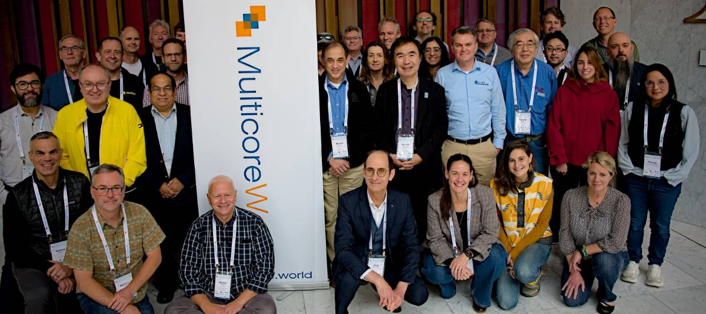

Join me at Multicore 2026 where I give an talk on what is needed to design a unified framework that bridges the gap between HPC simulations and AI training,
transforming fragmented data management into intelligent, reusable workflows.

 

 

<strong>Abstract:</strong> The next generation of HPC application is represented by hybrid approaches that weave together traditional simulations and modern AI.
However, a critical bottleneck in integrating HPC with AI is the “lack of awareness” between workflow components. 
The outputs of HPC applications are often analyzed only sparingly before archival, effectively becoming inaccessible for future 
training codes due to the manual, time-consuming processes of finding, and processing datasets for each analysis purpose, 
frequently outweighing the cost of re-running simulations. This fragmentation results in complex, brittle workflows where data management 
is treated as an afterthought. In this presentation, we propose a unified framework for managing the complex lifecycle of data in 
hybrid AI-HPC systems.
We will address the limitations of current domain-specific solutions by introducing abstractions that map the relationships 
between raw simulation outputs, processed training sets, and surrogate model inference. 
By creating a system where data provenance and transformation history are persistent, we enable
workflows that “learn” from previous executions. Attendees will learn how to design workflows that minimize redundant processing, 
facilitate cross-domain optimization transfer, and ensure that the massive datasets required for AI training remain accessible, 
structured, and reusable.

 
Multicore page of my talk: [Multicore talk page](https://multicore.world/speakers-2026/ana-gainaru/)
 
Slides: [Slides](https://multicore.world/wp-content/uploads/2026/02/mw26-gainaru.pdf)
 
YouTube video of my talk: https://www.youtube.com/watch?v=quxuKFFMkio

